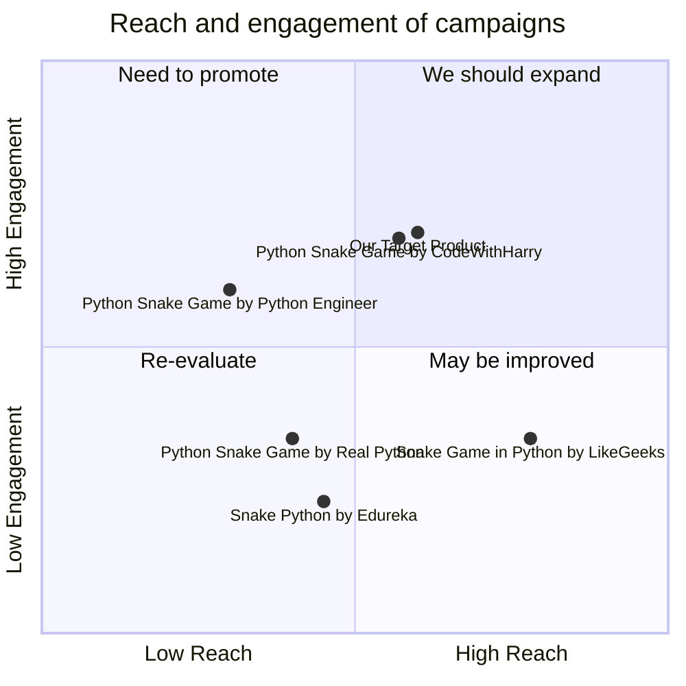

## Original Requirements
The boss has requested the creation of a snake game using Python.

## Product Goals
```python
[
    "Create a simple and engaging snake game using Python",
    "Ensure the game is user-friendly and easy to navigate",
    "Incorporate a scoring system to track player progress"
]
```

## User Stories
```python
[
    "As a user, I want to be able to easily start a new game so that I can play whenever I want",
    "As a user, I want the game to respond quickly to my commands so that I can effectively control the snake",
    "As a user, I want to see my score while I play so that I can track my progress",
    "As a user, I want the game to increase in difficulty as my score increases so that I am continuously challenged",
    "As a user, I want to be able to pause and resume the game so that I can take breaks when needed"
]
```

## Competitive Analysis
```python
[
    "Python Snake Game by Python Engineer: Simple and easy to play but lacks a scoring system",
    "Snake Python by Edureka: Includes a scoring system but the interface is not user-friendly",
    "Python Snake Game by CodeWithHarry: Has a user-friendly interface but lacks a pause/resume feature",
    "Snake Game in Python by LikeGeeks: Includes a pause/resume feature but the game does not increase in difficulty",
    "Python Snake Game by Real Python: The game increases in difficulty but lacks a user-friendly interface"
]
```

## Competitive Quadrant Chart


## Requirement Analysis
The product should be a snake game developed in Python. It should be user-friendly, responsive, and include a scoring system. The game should increase in difficulty as the player's score increases. The player should also be able to pause and resume the game.

## Requirement Pool
```python
[
    ("Develop the basic game mechanics (snake movement, food spawning, collision detection)", "P0"),
    ("Implement a user-friendly interface", "P0"),
    ("Incorporate a scoring system", "P0"),
    ("Increase game difficulty as score increases", "P1"),
    ("Add a pause/resume feature", "P1")
]
```

## UI Design draft
The game will have a simple and clean interface. The game area will be a square grid in the center of the screen. The snake and food will be represented by different colored squares. The score will be displayed at the top of the screen. The start, pause, and resume buttons will be located below the game area.

## Anything UNCLEAR
There are no unclear points.