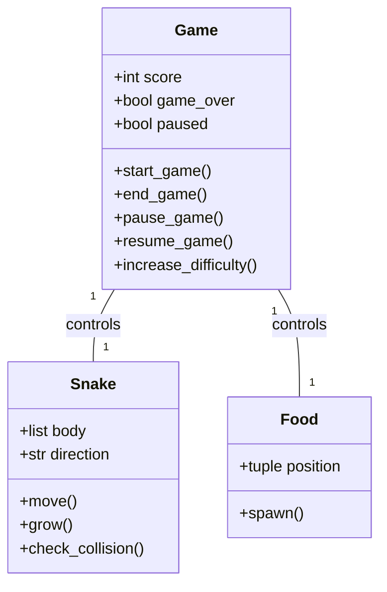
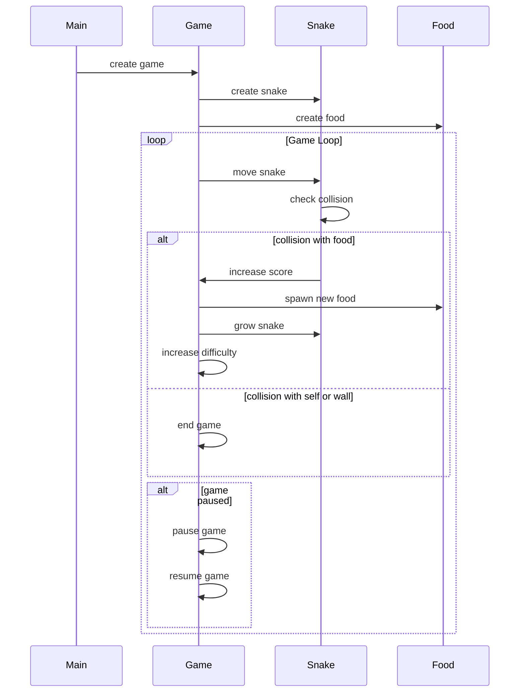

## Implementation approach
We will use Pygame, a popular open-source Python library for making games, to implement the snake game. The game will be designed in an object-oriented manner with separate classes for the game, snake, and food. The game mechanics will be implemented first, followed by the user interface, scoring system, and additional features. The game will be made more difficult by increasing the speed of the snake as the score increases. The pause/resume feature will be implemented using Pygame's event handling system.

## Python package name
```python
"snake_game_pygame"
```

## File list
```python
[
    "main.py",
    "game.py",
    "snake.py",
    "food.py",
    "constants.py"
]
```

## Data structures and interface definitions


## Program call flow


## Anything UNCLEAR
The requirement is clear to me.